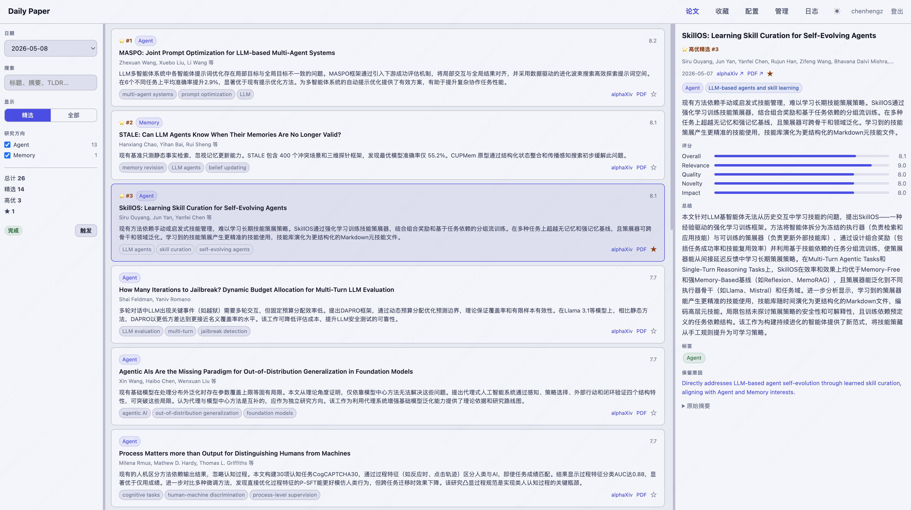
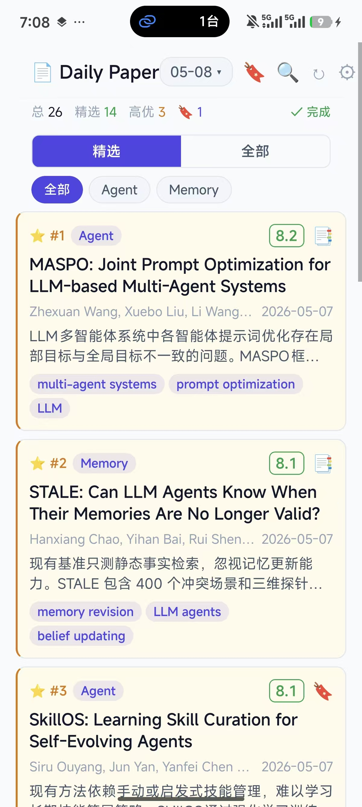

# Daily Paper

**每天自动抓取 arXiv 新论文，根据你的研究兴趣用 LLM 评分筛选，网页和手机随时浏览。** 告别信息过载，只看值得读的论文。

<p align="center">
  
  &nbsp;&nbsp;&nbsp;&nbsp;
  
</p>

## 功能亮点

- **个性化筛选**：设定研究方向和关键词，只推送你真正关心的论文
- **LLM 智能评分**：相关性、质量、新颖性、影响力四维度打分，附中文摘要
- **每日自动抓取**：定时爬取 arXiv，也可手动触发
- **多端同步**：网页端 + Android App，收藏随时同步
- **高优先级标记**：自动标出最值得关注的论文

## 个性化配置

登录后进入「配置」页面，可以设置以下内容：

| 配置项 | 说明 | 示例 |
|--------|------|------|
| 研究兴趣领域 | 按领域过滤论文，只保留相关方向 | `Agent, LLM, RL` |
| 高信号关键词 | 含有这些词的论文会被额外关注 | `agent, tool use, reasoning` |
| 低信号关键词 | 含有这些词的论文会被降权 | `survey, benchmark` |
| 关注作者 | 来自这些作者的论文会被额外关注并在结果中标注 | `Yann LeCun, Andrej Karpathy` |
| 定时抓取时间 | 每天自动运行的时间（Asia/Shanghai） | `18:00`（默认） |
| LLM API Key | 非内部用户填写自己的 Key，独立计费 | `sk-...` |


---

## 快速开始

### 1. 安装依赖

```bash
conda create -n daily python=3.12
conda activate daily
pip install -r requirements.txt
```

### 2. 配置环境变量

```bash
cp .env.example .env
# 用编辑器打开 .env，填写以下内容
```

**`.env` 完整说明：**

```bash
# ── LLM API（必填）──────────────────────────────────────
OPENAI_API_TYPE=openai               # openai（默认）或 azure
OPENAI_BASE_URL=https://api.openai.com/v1  # OpenAI-compatible 网关地址

# 单个 Key
OPENAI_API_KEY=sk-...

# 多个 Key（逗号分隔，总并发 = LLM_MAX_CONCURRENCY × key 数量）
# OPENAI_API_KEYS=sk-key1,sk-key2,sk-key3

# ── Azure 模式（OPENAI_API_TYPE=azure 时填写）───────────
# AZURE_ENDPOINT=https://your-resource.openai.azure.com
# AZURE_API_KEY=your-azure-key
# AZURE_API_VERSION=2024-03-01-preview

# ── 模型与限流──────────────────────────────────────────
LLM_MODEL_NAME=gpt-4o        # 模型名称
LLM_QPM=20                   # 单个 Key 每分钟请求上限
LLM_MAX_CONCURRENCY=16       # 单个 Key 最大并发数

# ── Session 加密────────────────────────────────────────
# SECRET_KEY=your-secret     # 固定后重启不需要重新登录
```

### 3. 启动服务

```bash
./start.sh
```

首次访问 `http://localhost:8000`，运行以下命令创建管理员账号：

```bash
./start.sh --create-admin
```

---

## start.sh 命令参考

| 命令 | 说明 |
|------|------|
| `./start.sh` | 启动 Web 服务（生产模式） |
| `./start.sh --dev` | 启动 Web 服务（开发模式，文件变更自动重载） |
| `./start.sh --android` | 启动 Expo 开发服务器（App 调试，development 模式） |
| `./start.sh --android-prod` | 启动 Expo 开发服务器（App 调试，production 模式） |
| `./start.sh --all` | 同时启动 Web 服务和 Expo 开发服务器 |
| `./start.sh --stop` | 停止所有已启动的服务 |
| `./start.sh --status` | 查看服务运行状态 |
| `./start.sh --create-admin` | 创建管理员账号 |
| `./start.sh --help` | 显示帮助 |

> `--dev` 模式下文件保存会触发服务重启，定时任务可能在重启期间漏触发，生产环境请使用默认模式。

---

## Android App

### 前置条件

- 安装 [Expo Go](https://expo.dev/go)（版本 55）
- 手机与电脑在同一 WiFi

### 启动调试服务器

```bash
./start.sh --android
```

扫描终端中的二维码，在 Expo Go 中打开。App 内 Setup 页面填写服务器地址：

```
http://<电脑IP>:8000
```

查看电脑 IP：

```bash
ifconfig | grep "inet " | grep -v 127.0.0.1   # macOS
ip route get 1.1.1.1 | awk '{print $7; exit}'  # Linux
```

> 手机访问时请使用局域网 IP，不要用 `localhost`。

### 构建 APK

```bash
cd android
npm install -g eas-cli
eas build --platform android --profile preview
```

---

## 日志

| 日志文件 | 内容 |
|----------|------|
| `logs/app.log` | Web 服务日志 |
| `logs/expo.log` | Expo 开发服务器日志 |

```bash
tail -f logs/app.log
```

---

## 技术栈

| 层 | 技术 |
|----|------|
| 后端 | FastAPI + SQLAlchemy + APScheduler |
| 数据库 | SQLite |
| 前端 | Jinja2 + 原生 JS |
| Android | React Native (Expo SDK 55) |
| LLM | OpenAI-compatible API |
